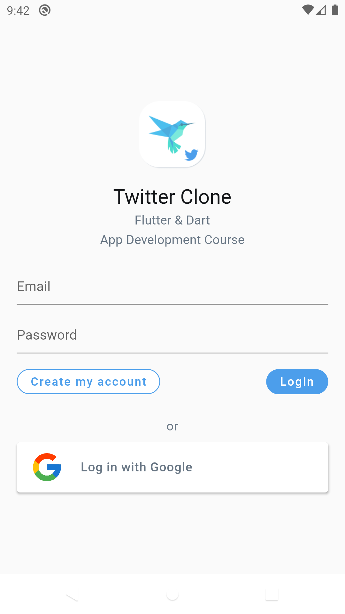
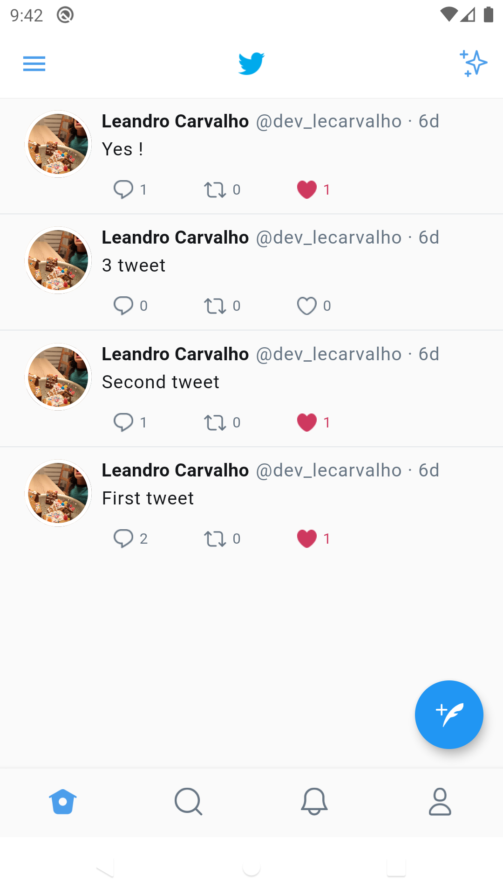
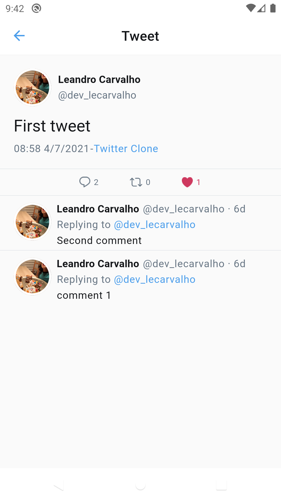
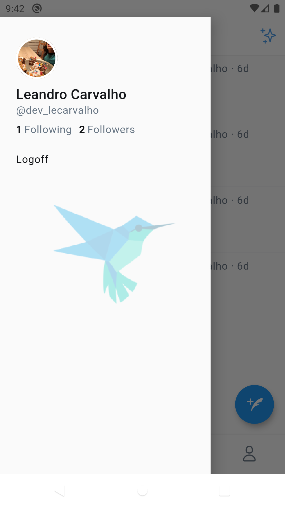
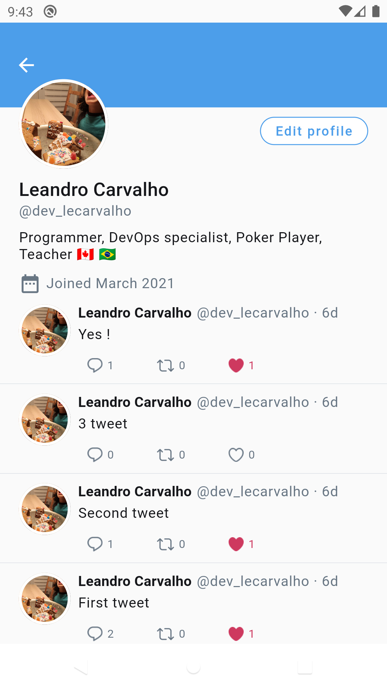
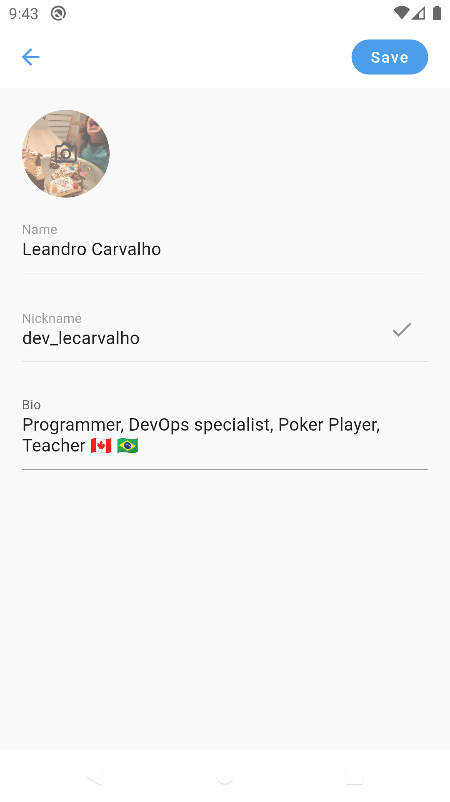
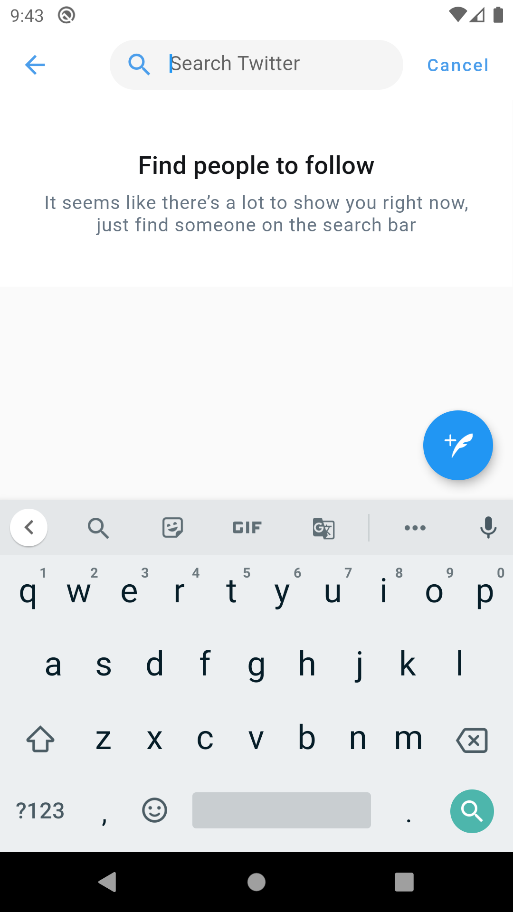
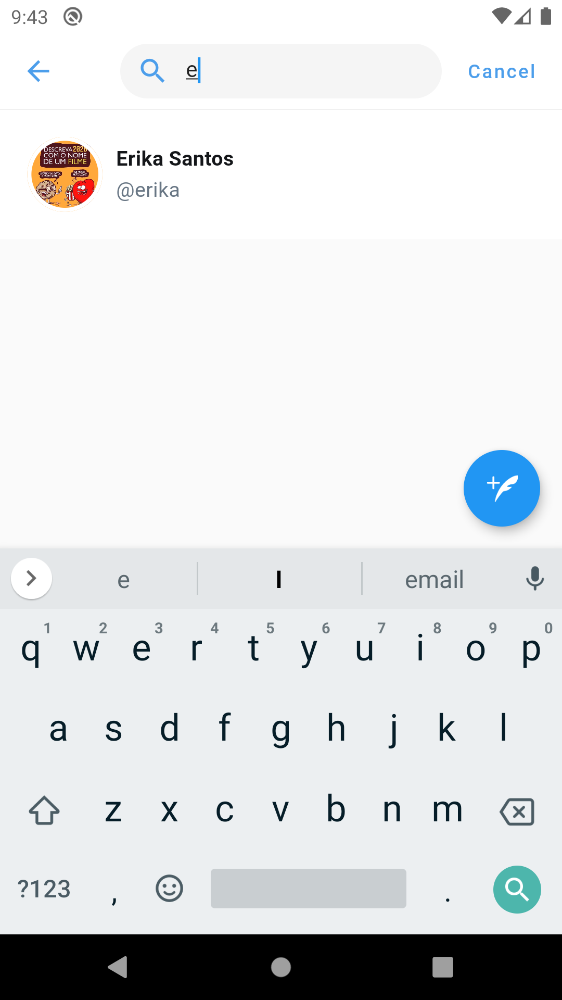
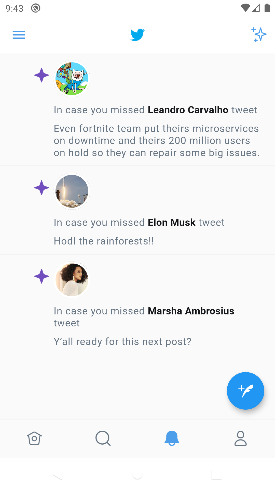

# Twitter Clone made with Flutter

- null-safety
- MVC
- setState - State Management (ephemeral state approach)
- Provider - Dependency Injections
- Firestore Database
- Firebase Auth (Google / Email - password)
- Firebase Storage

    
    
    
    
    
    
    
    
    
    

## Getting Started with Flutter

A few resources to get you started if this is your first Flutter project:

- [Lab: Write your first Flutter app](https://flutter.dev/docs/get-started/codelab)
- [Cookbook: Useful Flutter samples](https://flutter.dev/docs/cookbook)

For help getting started with Flutter, view our
[online documentation](https://flutter.dev/docs), which offers tutorials,
samples, guidance on mobile development, and a full API reference.
