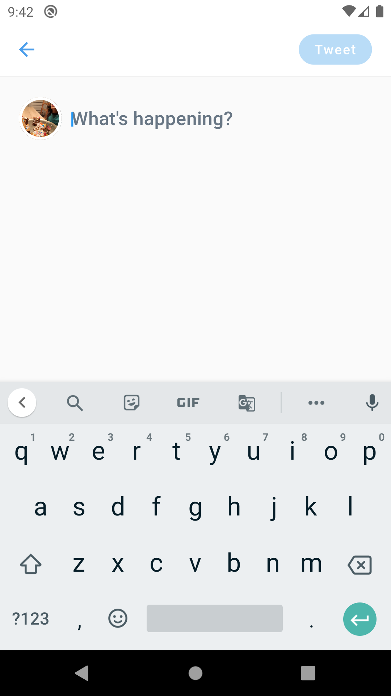

# Twitter Clone made with Flutter

- null-safety
- MVC
- setState - State Management (ephemeral state approach)
- Provider - Dependency Injections
- Firestore Database
- Firebase Auth (Google / Email - password)
- Firebase Storage

    
    
    
    
    
    
    
    
    
    
    

## To make it run on debug on your device

You need to generate to setup a new app on your Firebase account for Authentication.

1. Enable Google and Email / Password under Sign-in method
2. Give the package name as com.ds.twitter_clonepr
3. Download and replace the file **google-services.json** from Firebase under the project folder /android/app/
4. Generate a new certificate for the authentication purpose: https://developers.google.com/android/guides/client-auth?authuser=0 
5. Copy the generated sha-1 fingerprint.
6. On Sign-in method, under Google, Click on Project settings. 
7. Add the generated sha-1 fingerprint on your Firebase / Project settings, under **SDK setup and configuration** session.

## Getting Started with Flutter

A few resources to get you started if this is your first Flutter project:

- [Lab: Write your first Flutter app](https://flutter.dev/docs/get-started/codelab)
- [Cookbook: Useful Flutter samples](https://flutter.dev/docs/cookbook)

For help getting started with Flutter, view our
[online documentation](https://flutter.dev/docs), which offers tutorials,
samples, guidance on mobile development, and a full API reference.
